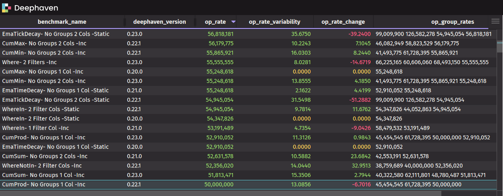

# Deephaven Benchmark

The Benckmark framework provides support for gathering performance measurements and statistics for operations on tabular data.  It uses the JUnit
framework as a runner and works from popular IDEs or from the command line.  It is geared towards scale testing interfaces capable of ingesting 
table data, transforming it, and returning tabular results. 

Currently, most benchmarks that use the framework are aimed at broad coverage of single query operations executed in 
[Deephaven Core Community](https://deephaven.io/community/) through the Barrage Java Client.  Tests focus on querying static parquet files, 
streamed Kafka topics, and replayed data.

The project maintains several hundred standardized benchmarks for Deephaven query operations that are tracked both from release-to-release and nightly.  
Results are regularly published to a read-only GCloud bucket available through the public storage API 
[deephaven-benchmark](https://storage.googleapis.com/deephaven-benchmark)   

The typical workflow of a Benchmark test is... *Configure table/column generation* --> *Execute Query* --> *Measure Results*.  This is all done inside a JUnit test class.

Tests are designed to scale by changing a scale property value call *scale.row.count*, and per-test scale multipliers, so the same test can be used in multiple runs 
at different scales for comparison.  For ease of comparison, collected results use processing rates for benchmarked operations in addition to elapsed time.  
MXBean metrics are also collected for each benchmark as well as details about the platform where each test ran.

Tests are run client-server, so the test runner does not need to be co-located with the Deephaven Engine.  Measurements and statistics are taken directly 
from the engine(s) to reduce the affect of I/O and test setup on the results.

Resources:
- [System Requirements](docs/GettingStarted.md) - Getting set up to run benchmarks against Deephaven Community Core
- [Test-writing Basics](docs/TestWritingBasics.md) - How to generate data and use it for tests
- [Collected Results](docs/CollectedResults.md) - What's in the benchmark results
- [Running from the Command Line](docs/CommandLine.md) - How to run the benchmark jar with a test package
- [Published Results Storage](docs/PublishedResults.md) - How to grab and use Deephaven's published benchmarks

## Concepts

### Self-guided API
The *Bench* API uses the builder pattern to guide the test writer in generating data, executing queries, and fetching results.  
There is a single API entry point where a user can follow the dots and look at the code-insight and Javadocs that pop up in the IDE. Provided properties 
can be overriden by builder-style "with" methods like *withRowCount()*.  A middle ground is taken between text configuration and configuration 
fully-expressed in code to keep things simple and readable.

### Scale Rather Than Iterations
Repeating tests can be useful for testing the affects of caching (Load file multiple times, is it faster on subsequent loads?), or overcoming a lack of 
precision in OS timers (Run fast function many times and average), or average out variability between runs (There's always anomalies). But if the 
scope is processing large data sets, then why not actually measure against large data sets?

### Adjust Scale For Each Test
When measuring a full set of benchmarks for transforming data, some benchmarks will naturally be faster than others (e.g. sums vs joins). Running all benchmarks
at the same scale (e.g. 10 million rows) could yield results where one benchmark takes a minute and another takes 100 milliseconds.  Is the 100 ms test 
meaningful, especially when measured in a JVM?  Not really, because there is no time to assess the impact of JVM ergonomics or OS background tasks.  Scale
multipliers can be set to amplify row count for tests that need it.

### Test-centric Design
Want to know what tables and operations the test uses? Go to the test.  Want to know what the framework is doing behind the scenes?  Step through the test.
Want to run one or more tests?  Start from the test rather than configuring an external tool and deploying to that. Let the framework handle the hard part.
The point is that a benchmark test against a remote server should be as easy and clear to write as a unit test.  As far as is possible, data generation 
should be defined in the same place it's used... in the test.

### Running in Multiple Contexts
Tests are developed by test-writers, so why not make it easy for them?  Run tests from the IDE for ease of debugging. Point the tests to a local or a remote
Deephaven Server.  Or packge tests in a jar and run them locally or remotely from the Benchmark uber-jar.

### Measure Where It Matters
The Benchmark framework has a way to inject measurements from the test code instead of relying on a mechanism that measures automatically behind the scenes.
This allows the test writer to measure where it makes sense.  Measurements can be taken across the execution of the test locally or retrieved from a remote source.
Either way the submission of the result to the Benchmark framework is under the test writer's control.
